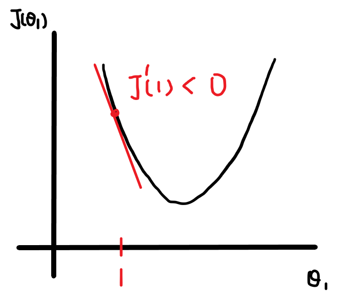
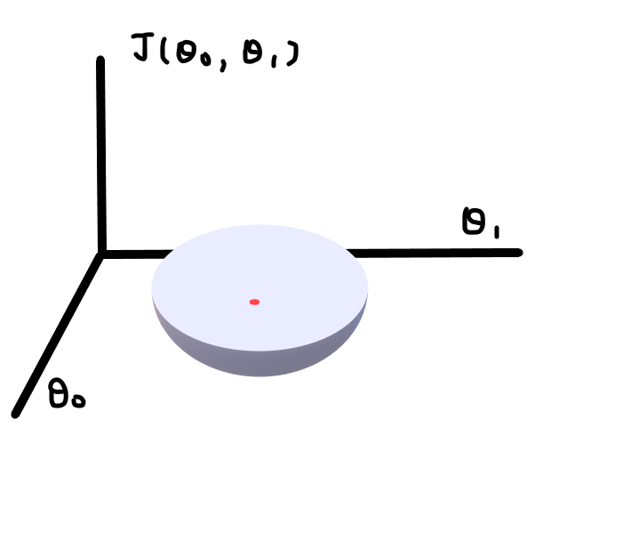
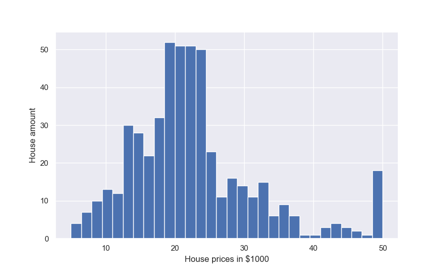
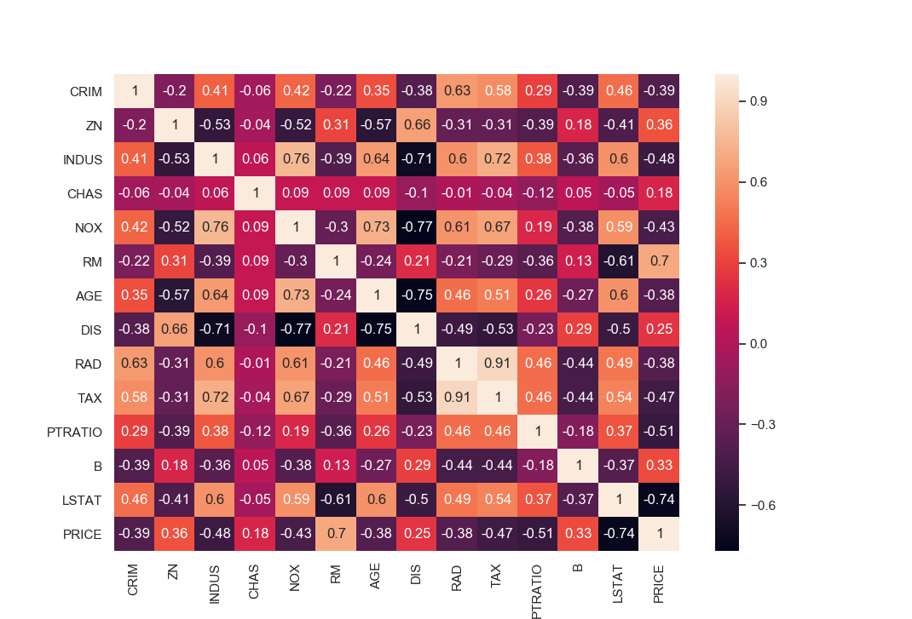
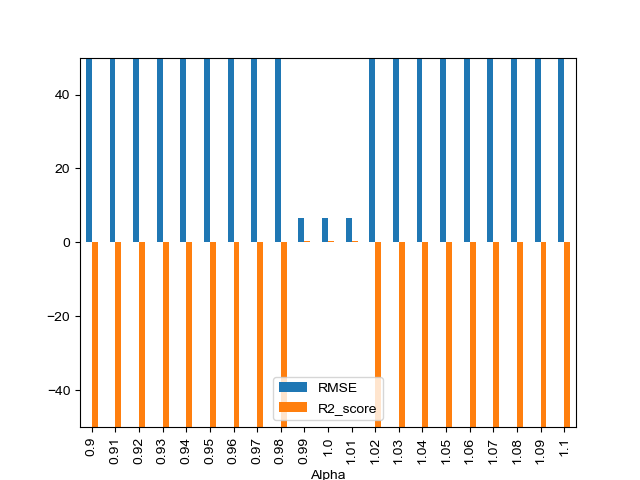
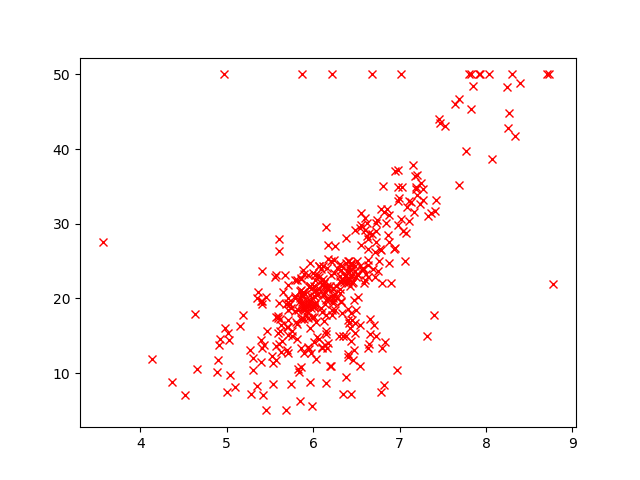

# Linear regression with Gradient descent

## Linear regression:
在二維空間中，若我們想要透過資料分布的情況，找出一條線性方程式(直線)來預測未來可能發生的情況，這時我們就可以透過線性規劃來完成。

### Hypothesis:
$h_\theta(x) = \theta_0 + \theta_1x$

這組方程式就是我們所希望得到的線性方程式，也就是常見的

$y = ax + b$

### Cost function:
$J(\theta_0,\theta_1) = \frac{1}{2m}\Sigma^{m}_{i=1}(h_\theta(x_i) - y_i)^2$

這是Linear regression的cost function，簡單來說是用來判斷當前$\theta_i$的好壞標準，並非所有cost function都長這樣。

$\Sigma^{m}_{i=1}(h_\theta(x_i) - y_i)^2$

這邊指的是讓預測值y_predict減去實際值y_reality，因此總體的值越小，表示模擬的情況愈佳，因此目標是$Minimize_{\theta_0,\theta_1}J(\theta_0,\theta_1)$。而$\frac{1}{2m}$的分母2則應該是為了讓待會做Gradient descent中的偏微分運算能更加方便。

## Gradient descent:

$\theta_0 = \theta_0 - \alpha \frac{\delta}{\delta\theta_0}J(\theta_0,\theta_1)$

$\theta_1 = \theta_1 - \alpha \frac{\delta}{\delta\theta_1}J(\theta_0,\theta_1)$

因此我們透過對$J(\theta_0,\theta_1)$的兩個$\theta$各自做偏微分，得到新的$\theta$(*這邊需要兩個$\theta$使用舊的值做完偏微分後再同時更新)。

偏微分的意義是讓$\theta$在斜率為負的情況下變大，斜率為正的情況下變小，反之亦然(如下圖)。而$\alpha$為learning rate，愈大$\theta$變化幅度愈大，反之亦然。





$\theta_i$各自偏微分過後為

$\theta_0 = \theta_0 - \alpha \frac{1}{m}\Sigma^{m}_{i=1}(h_\theta(x_i) - y_i)$

$\theta_1 = \theta_1 - \alpha \frac{1}{m}\Sigma^{m}_{i=1}(h_\theta(x_i) - y_i) * x_i$

## Simulation Result:

本篇使用的是sklearn中的boston dataset，總共有13個特徵維度(不包含PRICE)，506組樣本。

首先觀察PRICE的分布情況。



再透過dataframe中的corr函數來檢視PRICE和其他特徵的相關程度。



這邊發現和RM的特徵有0.7的相關程度，因此優先以此進行線性回歸。

對於線性回歸來說，$\alpha$(learning rate)的參數設定也是個需要考量的重點，因此這邊用0.9~1.0之間來測試，而判斷的依據則是用RMSE(均方根誤差)以及R2_score。

RMSE:用以判斷model預測情況和真實情況的誤差，愈小model愈好。

$RMSE = \sqrt{\frac{1}{N}\Sigma^{N}_{i=1}(Reality_i - Predicted_i)^2}$

R2_score:表示可根據自變量的變異來解釋因變量的變異部分，[1,-1]。

$R2_score = 1 - \frac{\Sigma^{N}_{i=0}(Reality_i - Predicted_i)^2}{\Sigma^{N}_{i=0}(Reality_i - \overline{Predicted_i})^2}$



從圖表中判斷，$\alpha$值從0.99到1.01之間都屬於能找到收斂的最佳解，因此這邊以1.01為$\alpha$進行20次迭代收斂，用Gif圖來看RM和PRICE的線性回歸迭代過程。



以上面的情況來看，一組自變量的線性規劃對Gradient Descent來說並不困難，但在多組自變量的情況下，則需要更多次的迭代才能達成。

這邊使用$\alpha$為0.000012，進行boston dataset中13個特徵的線性回歸。

```
Alpha: 1.2e-05
RMSE: 9.044795250613861
R2_score: 0.09467439109659592
Time: 0.19051098823547363 s
```
---

## Reference
http://hhtucode.blogspot.com/2013/04/ml-gradient-descent-algorithm.html

https://kknews.cc/zh-tw/other/q4j4eky.html

## License and copyright
© Jerry Cheng